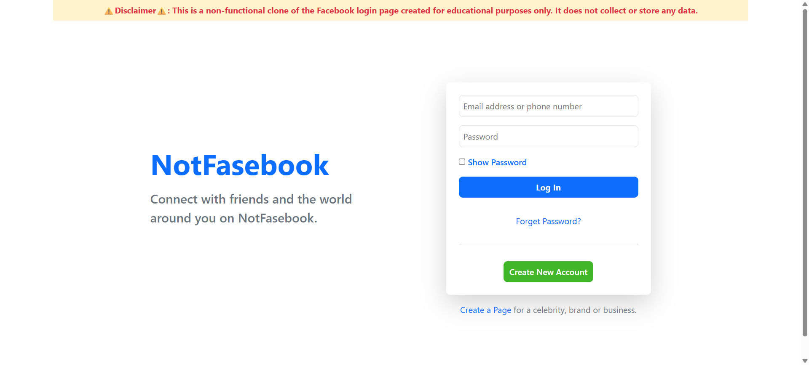

# Facebook Login Clone

A minimal clone of the Facebook login page using Bootstrap v5. This project is for educational and UI/UX practice only.

## 🚀 Features
- Responsive design using Bootstrap 5
- Clean HTML & CSS structure
- Mimics Facebook's login interface

## 🛠️ Technologies Used
- HTML5
- CSS3
- Bootstrap v5

## 📸 Preview


## 📂 How to Use
1. Clone the repo:
   ```bash
   git clone https://github.com/yourusername/facebook-login-clone.git
2. Open `index.html` in your browser.
